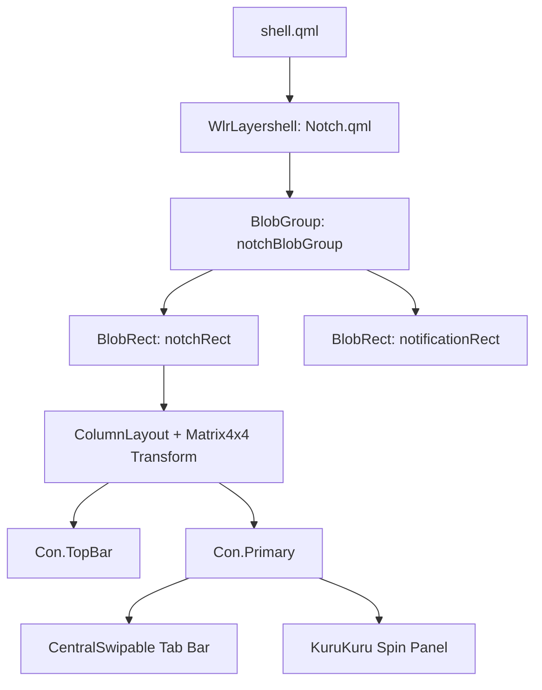

# Kurukuru Bar — Project Architecture & File Navigation

Welcome to the development overview of the **Kurukuru Bar**! This document serves as a guide for navigating the codebase, understanding how the layout and components interact, and mastering the dynamic, physics-based liquid-morphing system.

---

## 🚀 Architecture Overview

Kurukuru Bar is built as a modular shell using **Quickshell** (QtQuick/QML). The interface is layered dynamically to adapt to system states and user interaction.



### 1. The Core Layer (`Layers/Notch.qml`)
The entry point of the visible bar is `Notch.qml`. It wraps a `WlrLayershell` overlay anchored to the top of the screen.
* **States**:
  * `"COLLAPSED"`: A tiny dot/pill acting as a trigger at the top center.
  * `"EXPANDED"`: The status bar containing workspace controls, time, audio volume, and status icons.
  * `"FULLY_EXPANDED"`: The full settings dashboard showing swipe views, session controls, calendar, etc.
* **Physics & Deformation**:
  * Content inside the Notch (`TopBar` and `Primary` panels) is wrapped in a `ColumnLayout` styled with a `Matrix4x4` transform tracking the `deformMatrix` of the shell's `BlobRect`.
  * This links the inner widgets to the blob's jelly overshoot/undershoot animations, making content stretch and squish in lockstep with the outer liquid container.

---

## 💧 Liquid Blob Engine (`Caelestia.Blobs`)

The shell utilizes the `Caelestia.Blobs` plugin to construct liquid-morphing outlines.
* **`BlobGroup`**: The coordinator of the SDF (Signed Distance Field) shader. All `BlobRect`s attached to a single group will merge into a single fluid shape when they overlap or get close.
* **`BlobRect`**: Individual shape boundaries. They simulate physics using an underdamped spring:
  * `stiffness`: Controls how fast the shape springs back to its rest geometry.
  * `damping`: Determines how quickly oscillations die down.
  * `deformScale`: Controls velocity-induced stretching.
* **Exclusions**: Use the `exclude: [otherRect]` list to specify shapes that shouldn't merge with each other even if they overlap.

---

## 📁 Directory Structure & Navigation

### 1. `Containers/` (Core Layout Scaffolding)
* [CentralSwipable.qml](Containers/CentralSwipable.qml): Houses the page selection sidebar and the `SwipeView`. Implements the liquid Selection indicator using a sliding `BlobRect`.
* [Inbox.qml](Containers/Inbox.qml): Layout for the notification inbox list.
* [KuruKuru.qml](Containers/KuruKuru.qml): Container for the spinning Herta panel and floating notification indicator dots.
* [Primary.qml](Containers/Primary.qml): The layout for the dashboard panel.
* [TopBar.qml](Containers/TopBar.qml): Coordinates the top status line layout.

### 2. `Data/` (Backend Bindings & Configuration)
* [Colors.qml](Data/Colors.qml): Material 3 color palette and utility helpers.
* [Globals.qml](Data/Globals.qml): Global state singletons (active states, scales, workspace IDs).
* [NotifServer.qml](Data/NotifServer.qml): Implements the DBus notification receiver interface.
* [Paths.qml](Data/Paths.qml): Resolves assets, lockscreen backdrops, and user config directories.

### 3. `Layers/` (Quickshell Window Shells)
* [Notch.qml](Layers/Notch.qml): The main layershell wrapping top-bar and expanded panels.
* [LockScreen.qml](Layers/LockScreen.qml): Manages locks and triggers PAM/swaylock interfaces.
* [Wallpaper.qml](Layers/Wallpaper.qml): Handles backdrop rendering.

### 4. `Widgets/` (Inner Shell UI Elements)
* [BatteryDot.qml](Widgets/BatteryDot.qml): Small dot widget displaying current battery charge percent.
* [BatteryPill.qml](Widgets/BatteryPill.qml): Detailed battery info pill.
* [AudioSwiper.qml](Widgets/AudioSwiper.qml): Quick audio controller widget.
* [WorkspacePill.qml](Widgets/WorkspacePill.qml): Highlights the active/inactive virtual desktops.
* [SettingsView.qml](Widgets/SettingsView.qml): Tab containing audio control panels and style configurations.

### 5. `Generics/` (Reusable UI Components)
* [AudioSlider.qml](Generics/AudioSlider.qml): Interactive slider widgets for volume control.
* [MatIcon.qml](Generics/MatIcon.qml): Wrapper for Material Icon symbols.
* [Notification.qml](Generics/Notification.qml): Formatting structure for individual notifications.

---

## 🛠️ Developer Workflow

To test the bar, edit components and run the server locally:

```bash
# Start the quickshell daemon in foreground (automatically hot-reloads on save)
quickshell

# Trigger IPC state updates manually
quickshell ipc call config setWallpaper ~/Pictures/wall.png
```
